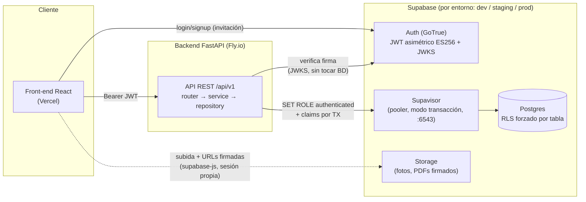
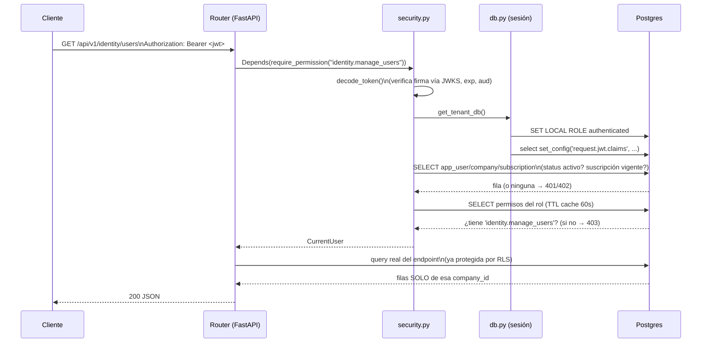
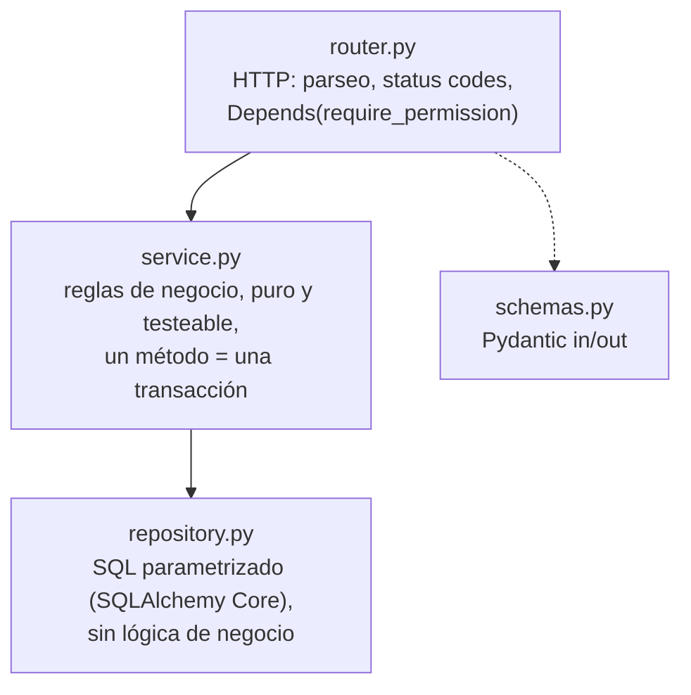

# Arquitectura del backend

> Referencia técnica de cómo está construido el backend y por qué. Para reglas de negocio y decisiones de producto ver `docs/CONTEXTO.md`; para el contrato de cada API ver `docs/API_GUIDE.md`; la guía completa de implementación está en `CLAUDE.md` (raíz del repo).

## 1. Qué es

Monolito modular multi-tenant en **FastAPI** (Python 3.12+, async) sobre **Supabase** (Postgres + Auth + Storage). Una sola base de datos compartida por todas las empresas (tenants); el aislamiento entre empresas lo hace **Row Level Security (RLS)** de Postgres, no código de aplicación. El backend nunca decide "a qué empresa pertenece esto" filtrando manualmente — se lo dice a Postgres una vez por transacción, y la base de datos hace cumplir el resto aunque haya un bug en una query.

Rutas de arquitectura descartadas (evaluadas y cerradas con el cliente, ver `CONTEXTO.md` §2): esquema-por-tenant y microservicios. Quedan como evolución futura posible, no como plan actual.

## 2. Panorama general



Puntos clave de este diagrama:

- El **front nunca le pega directo a Postgres para escrituras de negocio** — siempre pasa por el backend, que aplica reglas (intereses, estados, caja, etc.). Lecturas simples *podrían* ir directo React→PostgREST protegidas por RLS (decisión de arquitectura tomada), pero hoy todo pasa por la API. **Storage es la excepción explícita:** el front sube fotos y pide URLs firmadas directo con `supabase-js` y su propia sesión, sin pasar por la API — no hay lógica de negocio que aplicar, solo aislamiento por `company_id`, que RLS sobre `storage.objects` ya garantiza por sí sola (`docs/STORAGE_PENDIENTE.md` §6).
- El backend **no valida contraseñas ni emite tokens** — eso es 100% de Supabase Auth. El backend solo **verifica** la firma del JWT contra el JWKS público de Supabase (`SUPABASE_JWKS_URL`), sin ninguna llamada de red a Auth por request (la llave pública se cachea).
- La conexión a Postgres va por **Supavisor en modo transacción** (puerto 6543), pensado para muchas conexiones cortas desde un backend serverless/contenedor — nunca modo sesión.

## 3. Cómo se aplica el aislamiento multi-tenant (lo más importante de todo)

Cada tabla de negocio tiene `company_id` y una política RLS `USING (company_id = current_company_id())`. Pero eso por sí solo **no alcanza**: un rol superusuario de Postgres siempre bypassea RLS sin importar la política. Por eso cada request hace, dentro de su propia transacción:

```sql
SET LOCAL ROLE authenticated;              -- deja de ser superusuario para esta TX
SELECT set_config('request.jwt.claims', '{"sub":"...","company_id":"...","role_id":"..."}', true);
```

`SET LOCAL` y el `true` final de `set_config` (parámetro *is_local*) hacen que ambos efectos duren **solo esa transacción** — indispensable porque Supavisor en modo transacción reutiliza la misma conexión física para requests de usuarios distintos; si se fijara a nivel de sesión, un usuario podría heredar los claims del anterior.



Esto corre en **cada** request protegido — es literalmente `app/core/security.py` + `app/core/db.py`, no hay atajos por módulo.

**Gotcha real encontrado construyendo `GET /me` (migración `00010_plan_read_policy.sql`):** `enable row level security` + `force row level security` en una tabla SIN ninguna `create policy` no significa "sin restricción" — significa que Postgres deniega **todo** `select` por defecto, en silencio (cero filas, sin error). `plan` quedó así desde `00002_platform.sql` — nunca se notó porque cada lectura de `plan` hasta ahora pasaba por la sesión de bypass de `platform` (service-role, superusuario, ignora RLS). El primer código que leyó `plan` desde una sesión `authenticated` normal (el JOIN de `GET /me` con la suscripción activa) se encontró con 0 filas. Regla derivada: **toda tabla con `force row level security` necesita al menos una policy de SELECT antes de que algo tenant-scoped la use** — para catálogos globales (como `permission`, y ahora `plan`), la policy es simplemente `USING (current_company_id() IS NOT NULL)` (visible a cualquier autenticado, sin filtrar por empresa).

## 4. Capas dentro de cada módulo



Regla dura (CLAUDE.md): **un módulo no importa el `service` de otro módulo.** Si `platform` necesita invitar al primer admin de una empresa nueva, no llama `identity.service.invite_user` — llama `identity.integration.invite_user`, una función pensada explícitamente para ser consumida desde afuera (ver `app/modules/identity/integration.py`). Esto mantiene cada módulo dueño de sus propias reglas y evita que un cambio interno en `identity` rompa `platform` en silencio. El caso más cruzado hasta ahora es Rematar: `contracts.service.auction_contract` calcula cuánto se debe y llama `inventory.integration.create_draft_items_from_auction`, que a su vez usa `cashbox` indirectamente a través de `contracts` (el desembolso/cobro de un contrato SÍ pasa por `cashbox.integration`, pero crear los ítems de inventario del remate no toca caja — el dinero ya se contabilizó cuando se desembolsó el préstamo original).

`repository.py` no sabe nada de reglas de negocio — solo ejecuta SQL y devuelve filas. Toda decisión ("¿puede quitarse este permiso?", "¿hay que auditar esto?") vive en `service.py`.

## 5. Autenticación y autorización

- **Autenticación** = "¿este JWT es válido?" — `app/core/security.py::decode_token` + `get_verified_claims`. No toca la base de datos.
- **Sesión de usuario** = "¿este usuario existe, está activo, su empresa está activa y con suscripción vigente?" — `get_current_user`, sí toca la base de datos (con cache TTL corto de 30s para no repetirlo en cada request).
- **Autorización** = "¿su rol tiene el permiso X?" — `require_permission("modulo.accion")`, RBAC dinámico por empresa, cache TTL 60s por rol. Deny-by-default: un endpoint sin `Depends(require_permission(...))` es un bug, no un endpoint público.
- **Super-admin de plataforma** (gestiona empresas/suscripciones, fuera del modelo de tenant) = un caso aparte: no tiene fila en `app_user`, se identifica por el claim `app_metadata.platform_role == "super_admin"` que se fija manualmente en Supabase Auth (una sola vez, fuera de la app). Ver `require_super_admin` en `security.py`.

### El Custom Access Token Hook y el estado `invited`

Los claims `company_id`/`role_id` NO los pone el backend: los emite el **Custom Access Token Hook** (`public.custom_access_token_hook`, migración 00003) cuando Supabase Auth firma el token. `get_verified_claims` rechaza con 401 cualquier JWT que llegue sin ellos.

El hook emite claims para `status in ('active', 'invited')`, y esa lista es deliberada. **`invited` tiene que estar ahí**, y que faltara causó un bloqueo mutuo que impedía que cualquier invitado entrara (migración 00028):

1. El hook no emitía claims hasta que el usuario fuera `active`.
2. `get_verified_claims` rechazaba con 401 todo token sin claims.
3. Y el único código que pasaba al usuario de `invited` a `active` vivía **detrás** de esa validación, en `get_current_user`.

La auto-activación era código inalcanzable justo para el caso que fue escrito. El invitado veía *"Tu usuario o tu empresa están inactivos"*, un mensaje que apunta al lugar equivocado — no había nada inactivo, había un ciclo. No se detectó antes porque los usuarios de prueba se activaron a mano durante el desarrollo, así que nunca se recorrió el flujo completo de invitación.

Emitir claims para `invited` es seguro: significa "el admin ya lo dio de alta y todavía no ha entrado por primera vez", y para tener un JWT válido en la mano ya completó el flujo de Supabase (puso contraseña o usó Google), lo cual prueba que controla ese correo. El estado que sí corta el acceso es `inactive`. La condición **enumera lo permitido** en vez de negar `inactive`, para que cualquier estado nuevo nazca excluido.

Tests en `tests/integration/test_auth_flow.py`: ejercitan el hook directamente para los tres casos (invitado entra, desactivado no, empresa suspendida corta a todos).

## 6. Estructura del código

```
app/
  core/            settings, db (engine + claims por TX), security (JWKS/JWT/permisos), errors, logging
  common/          paginación por cursor, Money (Decimal + validación NUMERIC(14,2)),
                   Idempotency-Key, tenant_time ("hoy" en la zona horaria de la empresa)
  modules/
    platform/      empresas, planes, suscripciones (solo super-admin) +
                   integration.get_company_today (zona horaria por empresa, cacheada)
    identity/      usuarios, invitaciones, roles, permisos — tenant-scoped
    customers/     clientes
    catalogs/      categorías (árbol 3 niveles), proveedores
    contracts/     contratos de empeño: snapshot legal, abonos, máquina de estados
    cashbox/       sesiones (apertura/cierre con desglose, sin tolerancia de
                   diferencias), gastos, reapertura auditada. `integration.py`
                   (get_open_session/record_movement) lo usan contracts y sales
    inventory/     artículos (código inmutable al publicar), ingresos/egresos.
                   `integration.py` (create_draft_items_from_auction) lo usa
                   contracts para Rematar
    sales/         ventas, anulación con reposición de stock
    audit/         consulta paginada + filtrable de `audit_log` (inmutable,
                   la insertan los demás módulos en su propia transacción)
    reports/       dashboard de KPIs (contratos por estado + cartera, ventas
                   hoy/mes, inventario disponible, sesión de caja actual) e
                   histórico de cierres con filtro de fecha. Solo lectura;
                   usa `platform.integration.get_company_timezone` para que
                   "ventas de hoy" sea el día local de la empresa, no UTC
  jobs/            job nocturno: recalcula estados de contratos + vence
                   suscripciones, todas las empresas (§11 más abajo)
  main.py          create_app(): registra middlewares, exception handlers, routers
tests/
  unit/            reglas puras, sin BD (JWT, formato de errores, matrices de permisos, paginación)
  integration/     HTTP end-to-end contra Postgres real (local o el proyecto Supabase de dev)
  rls/             aislamiento entre tenants, tabla por tabla
supabase/
  migrations/      fuente de verdad del esquema — nunca se editan una vez aplicadas, se crea una nueva
  seed.sql         catálogo global de permisos + planes
```

## 7. Errores

Toda excepción de negocio hereda de `AppError` (`app/core/errors.py`) y se serializa siempre igual:

```json
{"code": "PERMISSION_DENIED", "message": "Falta el permiso 'identity.manage_users'.", "details": {"permission": "identity.manage_users"}}
```

`code` es estable y pensado para que el front decida comportamiento por código (mostrar un modal específico, redirigir, etc.), nunca parseando `message` (ese es para humanos, puede cambiar). Catálogo de códigos usados hasta ahora en `docs/API_GUIDE.md`.

## 8. Entornos y despliegue

- **Front:** Vercel (Vite + React).
- **Backend:** Fly.io (Docker), FastAPI + Uvicorn. **2 ambientes por ahora** (dev y prod — `staging` del plan original de 3 proyectos Supabase queda para cuando haga falta, mismo patrón): dos apps de Fly (`compraventa-backend-dev` / `compraventa-backend-prod`, `fly.dev.toml` / `fly.prod.toml`) y dos proyectos Supabase (`dev` = `driyubkodnsqxbtxcmaz`, ya existe; `prod` — por crear, mismos pasos del paso 1: `supabase migration up`/`db push` de las 8 migraciones + seed, JWKS asimétrico, Custom Access Token Hook).
- **Ramas:** `main` = solo lo ya probado en `dev` y mergeado (deploy a `compraventa-backend-prod`); `dev` = todo el trabajo en curso (deploy a `compraventa-backend-dev`). Nada llega a producción sin pasar antes por `dev`.
- **Datos:** cada proyecto Supabase con sus propias migraciones aplicadas vía Supabase CLI (`supabase link` + `supabase db push`), nunca a mano desde el dashboard.
- **CORS** (`app/common/cors.py`, aplicado en `main.py`): `ENVIRONMENT=dev` acepta `localhost:5173`/`localhost:3000` y cualquier preview de Vercel (`https://*.vercel.app`, regex) sin configurar nada — pensado para que el front pegue contra `compraventa-backend-dev` desde local o desde un preview de PR sin fricción. Producción es explícito y nada más: solo los orígenes exactos en `CORS_ALLOW_ORIGINS` (secret, coma-separado) — sin eso configurado, prod rechaza toda request de browser.
- **CI:** GitHub Actions (`.github/workflows/ci.yml`) — corre en push a `main` y a `dev`, y en cada PR. Lint + tipos + tests unitarios siempre; tests de integración/RLS contra un Postgres efímero (sin pooler, por eso no sufre el problema de Supavisor documentado en `docs/API_GUIDE.md`). Deploy a Fly todavía es manual (`fly deploy --config fly.dev.toml`/`fly.prod.toml`); automatizarlo en CI es el siguiente paso natural una vez el deploy manual esté probado.
- **Costos de Fly (verificado en fly.io/docs/about/pricing, agosto 2026):** ya no existe un tier gratis permanente (lo quitaron en 2024); el billing es por segundo mientras la máquina corre, no por mes fijo. Un `shared-cpu-1x`/256MB siempre encendido cuesta ~$2.02/mes; 512MB ~$3.32/mes. `dev` usa `auto_stop_machines=true` + `min_machines_running=0` (`fly.dev.toml`) — se apaga sola sin tráfico, así que en un ambiente de pruebas de uso intermitente el cómputo puede quedar en centavos al mes (con unos segundos de cold start en el primer request tras estar apagada). `prod` usa `min_machines_running=1` (siempre encendida, sin cold start) — esa sí cuesta el precio de lista completo. Aparte: ancho de banda de salida (~$0.02/GB en Norteamérica/Europa) e IP dedicada si se agrega una (no hace falta: Fly da IPv4 compartida + IPv6 gratis por defecto). Total estimado para los dos ambientes juntos con tráfico bajo: unos pocos dólares al mes, no los $8-25/mes que citan blogs de terceros asumiendo tráfico constante en ambos — pero son precios de lista de Fly, no una promesa: confirmar en el dashboard de facturación antes de asumir un número.
- **`dev` ya está desplegado**: `https://compraventa-backend-dev.fly.dev` (org `personal`, región `gru` — São Paulo; `bog`/Bogotá está deprecada en Fly y ya no acepta recursos nuevos). 1 máquina `shared-cpu-1x`/256MB con `auto_stop`/`auto_start`, secrets apuntando al Supabase `dev` (`driyubkodnsqxbtxcmaz`), más una Fly Machine programada (`--schedule daily`) para el job nocturno — corrida de verificación ya ejecutada con éxito contra la BD real. `prod` queda pendiente de un proyecto Supabase propio antes de desplegarse igual.

## 9. Por qué NullPool + `statement_cache_size=0`

`app/core/db.py` crea el engine así a propósito:

```python
create_async_engine(url, poolclass=NullPool, connect_args={"statement_cache_size": 0})
```

Bajo un pooler en modo transacción, la conexión física puede cambiar entre statements de un mismo "cliente lógico" sin que el driver se entere. Si `asyncpg` cacheara *prepared statements* (su comportamiento por defecto), podría reusar un plan preparado contra una conexión física que ya no es la misma → errores intermitentes difíciles de reproducir. `NullPool` evita que SQLAlchemy mantenga su propio pool de conexiones por encima del pooler (redundante y contraproducente), y `statement_cache_size=0` desactiva el cacheo de prepared statements de `asyncpg`. Es el patrón recomendado por Supabase para cualquier backend que hable con Supavisor.

## 10. "Hoy" siempre es la fecha de la EMPRESA, nunca la del servidor

Fly.io corre en UTC; Colombia es UTC-5 sin horario de verano. Cualquier `date.today()` del proceso del backend calcula el día equivocado durante una ventana de **5 horas todos los días** (7pm–medianoche hora Colombia), justo en horario de atención — no un caso raro de medianoche. Encontrado como bug real construyendo `cashbox` (paso 6): el pre-chequeo de "¿ya hay sesión hoy?" y el `INSERT` real usaban relojes distintos (Python vs. `current_date` de Postgres) y podían no coincidir.

Regla del proyecto desde entonces: ninguna regla de negocio con fecha usa `date.today()` ni `current_date` directamente. Se usa `app.modules.platform.integration.get_company_today(db, company_id=...)`, que lee `company.settings.timezone` (default `America/Bogota`, ya en el esquema) y cachea la consulta 5 minutos. `app/common/tenant_time.py` tiene la conversión pura (testeable con un instante fijo, sin depender del reloj real). Aplica hoy en `contracts` (meses adeudados, vencimientos, snapshot legal), `cashbox` (sesión diaria) y `reports` (ventas de hoy/mes, cierres listos para remate) — cualquier módulo nuevo con lógica de "qué día es hoy" debe usar el mismo mecanismo. Cuando además se necesita la zona horaria en sí (no solo la fecha, p. ej. para filtrar `sold_at` timestamptz por día local en SQL), `platform.integration` expone `get_company_timezone(db, company_id=...)` con el mismo caché.

## 11. Job nocturno

`app/jobs/nightly.py` es el único código del proyecto que corre **fuera** del ciclo de request de FastAPI. Hace dos cosas, cada una en su propia transacción de bypass (`AsyncSessionLocal` directo — no `get_tenant_db`, porque necesita ver todas las empresas, no una sola):

1. `contracts.service.recompute_all_statuses(db)` — recorre los contratos no terminales de TODAS las empresas y recalcula su estado (`app/modules/contracts/rules.py::compute_status`) contra el "hoy" de cada empresa. Ya existía desde el paso 5 pero nadie lo invocaba; el job es lo que lo vuelve real.
2. `platform.service.expire_overdue_subscriptions(db)` — marca `expired` las suscripciones cuyo `expires_at` ya pasó (según el "hoy" de esa empresa) y audita el cambio. Esto es lo que de verdad bloquea acceso: `security.get_current_user` rechaza con `402 SUBSCRIPTION_EXPIRED` en cuanto `subscription.status` deja de ser `active` — sin este job, una suscripción vencida seguiría dando acceso indefinidamente porque el chequeo en cada request compara contra el `status` persistido, no recalcula `expires_at` al vuelo.

Se invoca con `python -m app.jobs.nightly` (usa `app/core/logging.py`, mismo formato JSON que la API). Decisión de infraestructura (elegida explícitamente sobre pg_cron): un **Fly Machine programada**, no un cron dentro de Postgres — así la lógica de negocio sigue viviendo en un solo lugar (Python, reusando `contracts.service`/`platform.service` tal cual, sin portarla a SQL/PL-pgSQL). Deliberadamente NO va como un `[processes]` en `fly.toml` — eso obligaría a `fly deploy` a mantener una máquina "nightly" corriendo 24/7 por un job que debe correr una vez al día. En cambio, cada ambiente tiene su propia Fly Machine programada, independiente del fleet que gestiona `fly deploy`, apuntando a la imagen ya construida (comando exacto comentado en `fly.dev.toml`/`fly.prod.toml`, con `--schedule daily`).

## 12. La CUENTA es dónde está la plata; el MEDIO es cómo se cobró

Hasta la migración 00024 el sistema solo sabía `payment_method` (`cash` | `transfer` | `other`), un dato que vivía repetido en cinco tablas. Eso alcanza para decir "entró en efectivo", pero no para decir **a dónde** entró ni **cuánto hay** en cada lado. El caso que lo destapó fue Sistecrédito: el cliente sale con el artículo, Sistecrédito asume el riesgo y le paga a la compraventa **después**, menos una comisión. Con `payment_method` solo, esa venta cae en `other` — indistinguible de un cobro por Nequi o de cualquier otra cosa. No es plata que entró: es plata que te **deben**.

De ahí el catálogo de cuentas (`public.account`, tres tipos):

| tipo | qué es | saldo |
|---|---|---|
| `cash` | el cajón físico | base de la sesión abierta + movimientos de esa sesión |
| `bank` | una cuenta bancaria, Nequi, Daviplata | `opening_balance` + acumulado histórico |
| `settlement` | un convenio que te debe (Sistecrédito) | lo que te deben; baja al liquidar |

**El saldo se DERIVA, nunca se guarda.** Un saldo almacenado hay que mantenerlo sincronizado con cada operación, y en cuanto una falle o alguien inserte a mano queda mintiendo. Derivarlo no puede desincronizarse. Por el mismo motivo `account_balance()` **delega** en `list_accounts()` en vez de tener su propia consulta: dos formas de calcular el mismo saldo terminan divergiendo, y eso fue literalmente un bug (una cuenta recién creada reportaba 0 mientras el listado la mostraba bien, porque una sumaba el `opening_balance` y la otra no).

**El saldo de una `cash` se calcula distinto a propósito.** Es lo que debería haber en el cajón *ahora mismo*: la base con la que se abrió la sesión más los movimientos de esa sesión. Sumar el histórico completo daría un número negativo y sin sentido, porque los préstamos desembolsados superan lo cobrado — la base de apertura **no es un movimiento**. Sin sesión abierta el cajón está cuadrado y cerrado: no hay saldo vivo que reportar.

**`payment_method` se conservó, y es una decisión, no una omisión.** Es el dato del *documento*: una venta se cobró "en efectivo" y eso sigue siendo cierto aunque después la cuenta se renombre o se desactive. El comprobante impreso lo muestra; derivarlo de la cuenta actual haría que un comprobante viejo cambiara de texto porque alguien renombró una cuenta hoy — el mismo problema que ya se evitó congelando el costo en la línea de venta (00019) y la tasa en el snapshot del contrato.

**Quién exige la sesión de caja.** No la operación, sino el **tipo de cuenta**. Cobrar en efectivo necesita el cajón abierto; una venta por Sistecrédito o una transferencia no pasa por él y no tiene por qué quedar bloqueada porque nadie abrió caja. La regla vive en un solo lugar, `cashbox.integration.resolve_account_for_movement()`, que además completa la cuenta predeterminada cuando la operación no la eligió. Postgres no admite subconsultas en un `CHECK`, así que la restricción "movimiento de cuenta `cash` ⇒ tiene sesión" es del servicio, no del esquema (regla 2 de CLAUDE.md).

**El esperado del cierre también sale del tipo de cuenta**, por lo mismo: un gasto pagado por transferencia no salió del cajón, y restarlo dejaba el arqueo buscando billetes que nunca estuvieron ahí.

**Liquidar un convenio** (`POST /accounts/{id}/settle`) mueve el saldo de la `settlement` a la cuenta que recibió la plata. La comisión se **deriva** (`amount_settled − amount_received`) y no genera movimiento propio: no es plata que salió, es plata que nunca llegó.

**Alta de empresa.** `platform.create_company_defaults` crea las tres cuentas iniciales junto a los roles semilla y la caja principal — son parte del mismo alta. Que no lo hiciera fue un bug real, invisible mientras `payment_method` fue la fuente de verdad y destapado recién al derivar el saldo por cuenta: aparecieron cientos de movimientos sin cuenta, todos de empresas nacidas después del backfill de 00024.

Migraciones: **00024** (catálogo + `account_id` en las cinco tablas + backfill), **00025** (`opening_balance`), **00026** (`session_id` opcional), **00027** (`account_id` NOT NULL, con auto-reparación previa).
